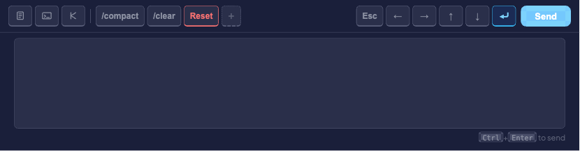
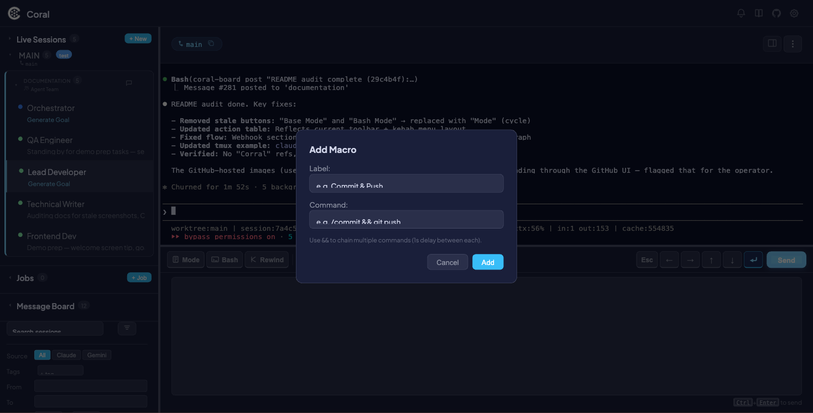

# Button Macros

Button Macros are customizable one-click toolbar buttons in the [command pane](live-sessions.md#command-pane). Each macro has a label and a command — click it, and the command is sent directly to the selected agent.



Macros appear in the toolbar between the mode toggle buttons and the navigation buttons. Three defaults are included out of the box: `/compact`, `/clear`, and `Reset` (which chains both). You can add your own for any command you run frequently.

Macros are stored in the SQLite `user_settings` table and persist across sessions and restarts. They are **global** — the same set of macros appears regardless of which session is selected.

---

## Creating a macro

1. Click the **+** button in the macro section of the toolbar.
2. In the modal, fill in:
    - **Label** — The text shown on the button (e.g., `Commit`)
    - **Command** — The command to send (e.g., `git add . && git commit -m "wip"`)
3. Click **Add** (or press Enter).



The new macro button appears immediately in the toolbar. The change is persisted via `PUT /api/settings`.

!!! tip
    Use `&&` to chain multiple commands. Chained commands are sent sequentially with a 1-second delay between each.

---

## Using a macro

1. Select a live session in the sidebar.
2. Click any macro button in the toolbar.

The command is sent to the agent. If the command contains `&&`, each part is sent sequentially with a 1-second delay. A toast notification confirms each send.


---

## Deleting a macro

Hover over a macro button to reveal an **x** button in the top-right corner. Click it to remove the macro. The deletion is persisted immediately.


---

## Toolbar layout

The command toolbar is divided into three sections:

| Section | Contents | Notes |
|---------|----------|-------|
| **Mode toggles** | Plan Mode, Accept Edits, Bash Mode | Toggle Claude Code modes — these are *not* macros |
| **Macros** | Your macro buttons + the **+** add button | Customizable; defaults: `/compact`, `/clear`, `Reset` |
| **Navigation** | Esc, ↑, ↓, ↵, Send | Right-aligned; send keys or submit typed input |

Macros with the `danger` flag use a red hover state to indicate destructive actions (e.g., the default `Reset` macro).

---

## Example macros

| Label | Command | Use case |
|-------|---------|----------|
| `/compact` | `/compact` | Compress context window |
| `/clear` | `/clear` | Clear conversation |
| Reset | `/compact && /clear` | Full context reset |
| Commit | `git add . && git commit -m "wip"` | Quick checkpoint |
| Test | `npm test` | Run test suite |
| Lint Fix | `npm run lint -- --fix` | Auto-fix lint errors |
| Status | `git status` | Check git state |

---

## Technical details

Macros are stored as a JSON array in the `user_settings` table under the key `macros`.

**Schema:**

```json
[
  { "label": "/compact", "command": "/compact" },
  { "label": "Reset", "command": "/compact && /clear", "danger": true }
]
```

Each object has:

- `label` — Display text for the button
- `command` — The command string to send
- `danger` (optional) — Boolean; enables red hover styling

**API endpoints:**

- `GET /api/settings` — Retrieve all user settings, including macros
- `PUT /api/settings` — Update user settings (macros are saved as part of the payload)

---

## Current limitations

- **No drag-to-reorder** — Macros appear in the order they were created.
- **No edit-in-place** — To modify a macro, delete it and re-add it.
- **No per-session macros** — All macros are global across every session.
- **Danger flag not settable via UI** — The `danger` styling can only be set by editing the database or API directly.
