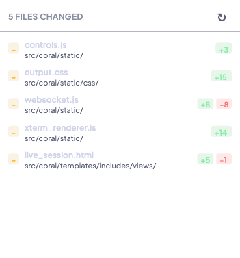

# Git Integration & PR Linking

Coral tracks git state for every live agent session — current branch, commits, remote URLs, and per-file change statistics. A background poller snapshots git state every 2 minutes, and the dashboard surfaces this data throughout the UI: branch tags in the sidebar, commit info in session headers, and a full changed-files view.

This ties agent activity back to concrete code changes and makes it easy to see what each agent has done.

---

## Branch tracking

Coral displays the current git branch for each agent session in multiple places:

| Location | Display |
|----------|---------|
| **Sidebar** | Branch tag next to each session name |
| **Session header** | Branch name with a copy-to-clipboard button |
| **Info modal** | Branch and latest commit hash + message |
| **History** | Branch name on each historical session entry |

The branch is polled every 120 seconds from each agent's working directory using `git rev-parse --abbrev-ref HEAD`.

---

## Commit tracking

### Live sessions

The latest commit is shown in the session header and Info modal. Each snapshot captures:

- **Commit hash** — Short and full SHA
- **Subject** — First line of the commit message
- **Timestamp** — Author date in ISO format
- **Remote URL** — From `git remote get-url origin` (HTTPS or SSH)

Commits are deduplicated per session — the same commit hash is only recorded once per session, even across multiple polling cycles.

### Historical sessions

The **Commits** tab in the session detail view shows all git commits that occurred during the session's time range. Each commit displays its hash, subject, author, and timestamp, giving you a complete record of what code the agent produced.

---

## Changed files

Coral tracks per-file diff statistics for each session, showing exactly which files an agent has modified.

For each file, the dashboard shows:

| Field | Description |
|-------|-------------|
| **File path** | Relative path in the repository |
| **Additions** | Number of lines added |
| **Deletions** | Number of lines removed |
| **Status** | `M` (modified), `A` (added), `D` (deleted), or `??` (untracked) |

The git poller computes changes by diffing against a smart base reference — typically `main` or `master` — so you see all changes on the feature branch, not just the latest commit.



!!! info
    Untracked files are included only if their modification time is after the base branch's latest commit, filtering out pre-existing files that aren't part of the agent's work.

---

## PR linking

Coral tracks the remote URL for each session's repository (via `git remote get-url origin`). When a remote URL is available, the dashboard can link directly to the repository on GitHub, GitLab, or other hosting platforms.

---

## Git worktree integration

Coral is designed around git worktrees — each agent runs in an isolated working directory so that parallel agents never conflict.

### Why worktrees?

| Benefit | Description |
|---------|-------------|
| **Isolated changes** | Each agent edits files without affecting other agents |
| **Different branches** | Agents can work on separate feature branches simultaneously |
| **Safe merging** | Changes stay isolated until explicitly merged |

### Worktree commands

```bash
# Create a worktree on a new branch
git worktree add ../feature-auth -b feature/auth

# Create a worktree on the same branch
git worktree add ../worktree_2 main

# List all worktrees
git worktree list

# Remove a worktree
git worktree remove ../feature-auth

# Clean up stale references
git worktree prune
```

!!! tip
    The `launch-coral` CLI automatically discovers subdirectories and creates one agent per worktree, so you can set up worktrees and launch agents in a single command.

---

## How it works

The **Git Poller** is a background task that runs every 120 seconds:

1. Groups all live sessions by working directory (to query git once per directory)
2. For each directory, runs:
   - `git rev-parse --abbrev-ref HEAD` — current branch
   - `git log -1 --format=%H|%s|%aI` — latest commit hash, subject, timestamp
   - `git remote get-url origin` — remote URL (best effort)
   - `git diff <base> --numstat` — per-file change statistics
   - `git status --porcelain --untracked-files=all` — untracked files
3. Upserts results into `git_snapshots` (deduplicated by session_id + commit_hash)
4. Replaces `git_changed_files` entries for each session (full snapshot each cycle)

### Database tables

| Table | Key columns |
|-------|-------------|
| `git_snapshots` | session_id, branch, commit_hash, commit_subject, commit_timestamp, remote_url, recorded_at |
| `git_changed_files` | session_id, filepath, additions, deletions, status, recorded_at |

---

## See also

- [Multi-Agent Orchestration](multi-agent-orchestration.md) — How agents use worktrees in parallel
- [Live Sessions](live-sessions.md) — Where git data appears in the dashboard
- [Session History & Search](session-history-search.md) — Historical session commits
