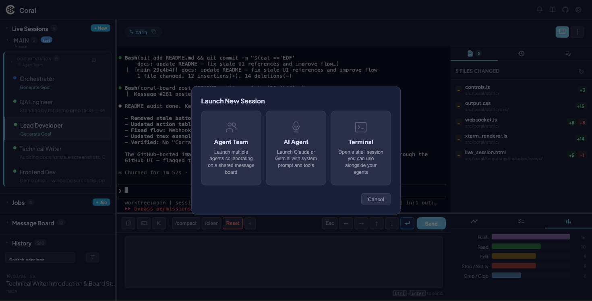
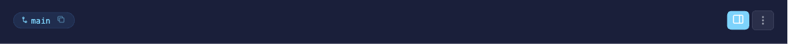
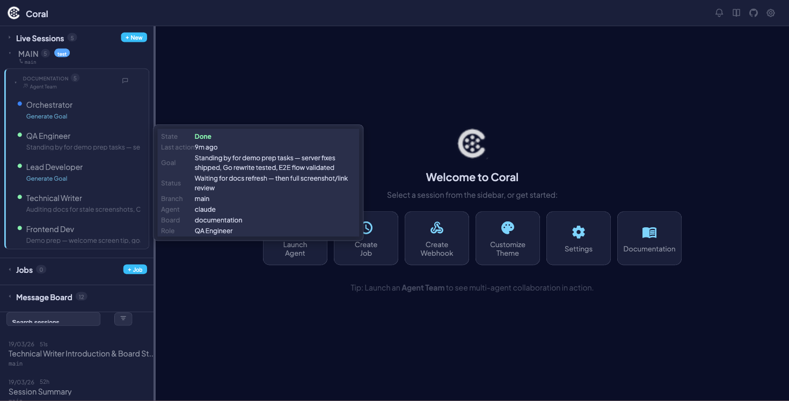

# Multi-Agent Orchestration

Multi-Agent Orchestration is Coral's core capability: run multiple AI coding agents in parallel, each in its own git worktree, managed via tmux, and monitored through a single dashboard.

Every agent runs in a dedicated tmux session named `{agent_type}-{uuid}`. Output is piped to a log file via `tmux pipe-pane`, and the dashboard discovers agents by parsing tmux session names. You can launch up to `MAX_AGENTS=5` agents through the CLI launcher, or add more at any time through the dashboard.

Both **Claude** and **Gemini** agents are supported, and you can run them side by side.


---

## Why multi-agent?

| Benefit | How Coral delivers it |
|---------|----------------------|
| **Parallel development throughput** | Each agent works in an isolated git worktree, so changes never conflict during development |
| **Task specialization** | Assign different tasks to different agents — one on backend, another on frontend |
| **Mixed agent types** | Run Claude and Gemini side by side to leverage each model's strengths |
| **Centralized monitoring** | One browser tab shows every agent's terminal, activity, tasks, and notes |
| **Reduced context-switching** | Status dots and **NEEDS INPUT** badges tell you at a glance which agents need attention |

---

## Getting started

### Step 1: Set up git worktrees

Create worktrees so each agent has its own isolated checkout:

```bash
# From your main repo
git worktree add ../worktree_2 main
git worktree add ../worktree_3 main
```

Each worktree is a full working copy on the same branch (or different branches). Agents can make changes independently without stepping on each other.

### Step 2: Launch via CLI

```bash
# Launch Claude agents for all worktrees in a directory
launch-coral /path/to/parent-dir

# Launch Gemini agents instead
launch-coral /path/to/parent-dir gemini
```

What happens behind the scenes:

1. Iterates subdirectories up to `MAX_AGENTS=5`
2. Generates a UUID for each agent session
3. Creates a tmux session named `{agent_type}-{uuid}`
4. Sets up `pipe-pane` logging to `/tmp/{agent_type}_coral_{folder}.log`
5. Launches the agent with `--session-id` and injects `PROTOCOL.md`
6. Opens a native terminal window per agent
7. Starts the web server on port `8420`

### Step 3: Launch via dashboard

Click the **+ New** button in the sidebar header, or use the API directly:

```bash
curl -X POST http://localhost:8420/api/sessions/launch \
  -H "Content-Type: application/json" \
  -d '{"working_dir": "/path/to/worktree", "agent_type": "claude", "display_name": "Auth Feature"}'
```



!!! tip
    Dashboard-launched sessions are not limited by `MAX_AGENTS` — you can add as many as your machine can handle.

### Step 4: Monitor agents

The dashboard keeps you connected to every agent in real time:

- **WebSocket `/ws/coral`** — Polls the full session list every 3 seconds
- **WebSocket `/ws/terminal/{name}`** — Streams terminal content for the selected session
- **Status dots** — Green (active), yellow (stale), amber (waiting for input)
- **PULSE protocol** — Agents emit structured `||PULSE:STATUS||` and `||PULSE:SUMMARY||` markers that the dashboard parses into readable status and goal fields



### Step 5: Interact with agents

Once agents are running, you can control them from the dashboard:

- **Send commands** via the input bar at the bottom of the session view
- **Quick-action buttons** for common operations (Plan Mode, Accept Edits, Bash Mode, macros)
- **Restart** or **Kill** agents from the session header
- **Rename** agents by right-clicking in the sidebar

!!! info
    Your input text is preserved per-session — switch between sessions without losing what you were typing.

---

## Supported agent types

### Claude

| Property | Detail |
|----------|--------|
| **Launch command** | `claude --session-id {uuid}` |
| **Resume support** | Yes — restart with `--resume` to continue a previous session |
| **History location** | `~/.claude/projects/**/*.jsonl` |
| **Tool event tracking** | Rich activity timeline (Read, Write, Edit, Bash, Grep, Glob, Web, Subagents) |

### Gemini

| Property | Detail |
|----------|--------|
| **Launch command** | Uses `GEMINI_SYSTEM_MD` env var for protocol injection |
| **Resume support** | No |
| **History location** | `~/.gemini/tmp/*/chats/session-*.json` |
| **Tool event tracking** | Basic (parsed from terminal output) |

### Custom agents

You can add support for other agent types by subclassing `BaseAgent` and calling `register_agent()`:

```python
from coral.agents.base import BaseAgent, register_agent

class MyAgent(BaseAgent):
    agent_type = "myagent"
    # Override launch, build_command, parse_history, etc.

register_agent(MyAgent)
```

!!! warning
    Custom agents must follow the PULSE protocol to get status and goal updates in the dashboard. See [Protocol](protocol.md) for the full spec.

---

## Git worktree integration

### Why worktrees?

Git worktrees give each agent a fully isolated working directory:

- **Isolated changes** — Each agent edits files without affecting other agents
- **Different branches** — Agents can work on separate feature branches simultaneously
- **Safe merging** — Changes stay isolated until explicitly merged

### Git polling

Coral polls git state every **120 seconds** for each session, collecting:

- Current branch name
- Latest commit hash and message
- Remote URL

### Git state in the dashboard

- **Branch tag** in the sidebar next to each session name
- **Commit history** available via the API
- **Session-linked commits** tie git activity back to the agent that made them

### Worktree commands reference

```bash
# Create a worktree on a new branch
git worktree add ../feature-auth -b feature/auth

# List all worktrees
git worktree list

# Remove a worktree
git worktree remove ../feature-auth

# Clean up stale worktree references
git worktree prune
```

---

## Dashboard UI guide

### Sidebar

Each session in the sidebar shows:

| Element | Description |
|---------|-------------|
| **Status dot** | Color-coded activity indicator (green, yellow, amber, gray) |
| **Display name** | Custom name or worktree folder name |
| **Agent type badge** | `CLAUDE` or `GEMINI` with distinct styling |
| **Branch tag** | Current git branch |
| **NEEDS INPUT badge** | Appears when the agent is waiting for a response |
| **Tooltip** | Hover for full session details |




### Session switching

Click any session in the sidebar to switch to it. When switching:

- Input text you were typing is **preserved** per-session
- The terminal view loads the selected agent's output
- Tasks, notes, and activity timeline update to the selected session
- Event history loads from the database

---

## Related pages

- [Live Sessions](live-sessions.md) — Full guide to the session view, terminal, command pane, and side panel
- [Scheduled Jobs](scheduled-jobs.md) — Automate agent launches on a schedule
