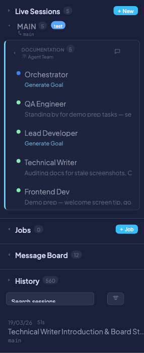

# One-Time Jobs

One-Time Jobs are fire-and-forget tasks triggered via the REST API. Each job runs an AI agent in an isolated git worktree, executes the given prompt, and cleans up after itself. They are ideal for automation, CI/CD integration, and batch processing — no interactive session required.

Unlike [Live Sessions](live-sessions.md), which are interactive and long-lived, and [Scheduled Jobs](scheduled-jobs.md), which run on a cron schedule, One-Time Jobs are ad-hoc: you submit a prompt via API, and the agent does the rest.

---

## Quick start

Submit a job with a single `curl` command:

```bash
curl -X POST http://localhost:8420/api/tasks/run \
  -H "Content-Type: application/json" \
  -d '{"prompt": "Run the test suite and fix any failures", "repo_path": "/path/to/repo"}'
```

Response:

```json
{"run_id": 42, "status": "pending"}
```

The agent picks up the job, creates an isolated worktree, runs the prompt, and tears down the worktree when finished.

---

## Submitting a job

**Endpoint:** `POST /api/tasks/run`

Send a JSON body with the following parameters:

| Parameter | Required | Default | Description |
|-----------|----------|---------|-------------|
| `prompt` | Yes | — | Instruction sent to the agent |
| `repo_path` | Yes | — | Absolute path to the git repo |
| `agent_type` | No | `"claude"` | `claude` or `gemini` |
| `base_branch` | No | `"main"` | Branch to base the worktree on |
| `create_worktree` | No | `true` | Create an isolated git worktree for the run |
| `cleanup_worktree` | No | `true` | Remove the worktree when the job completes |
| `max_duration_s` | No | `3600` | Timeout in seconds |
| `flags` | No | `""` | Extra CLI flags passed to the agent |
| `display_name` | No | `null` | Label shown in the dashboard sidebar |
| `webhook_url` | No | `null` | URL to receive status callback POSTs |
| `auto_accept` | No | `false` | Automatically respond to permission prompts |
| `max_auto_accepts` | No | `10` | Safety cap on the number of auto-accepts |

**Example — full request:**

```bash
curl -X POST http://localhost:8420/api/tasks/run \
  -H "Content-Type: application/json" \
  -d '{
    "prompt": "Refactor the auth module to use dependency injection",
    "repo_path": "/home/dev/myproject",
    "agent_type": "claude",
    "base_branch": "develop",
    "display_name": "Auth Refactor",
    "max_duration_s": 1800,
    "auto_accept": true,
    "max_auto_accepts": 5,
    "webhook_url": "https://hooks.example.com/coral"
  }'
```

!!! tip
    Set `display_name` to give the job a meaningful label in the sidebar instead of a generic run ID.

---

## Monitoring jobs



Active jobs appear in the **Jobs** section of the sidebar. Each entry shows:

- **Status dot** — Color-coded by state (green = running, yellow = pending, gray = completed)
- **Display name** — The `display_name` you provided, or a default label
- **Trigger badge** — `api` for one-time jobs, `cron` for scheduled jobs
- **Elapsed time** — How long the job has been running

Click a **running** job to view its live terminal output, just like a live session. Pending jobs are visible in the sidebar but not clickable until the agent starts.

---

## Managing jobs

### Poll job status

```bash
GET /api/tasks/runs/{run_id}
```

Returns the current state of the job, including status, start time, duration, and result.

### Cancel a running job

```bash
POST /api/tasks/runs/{run_id}/kill
```

Terminates the agent and cleans up the worktree (if `cleanup_worktree` was enabled).

### List past runs

```bash
GET /api/tasks/runs?limit=50&status=running
```

Filter by `status` (`pending`, `running`, `completed`, `failed`, `killed`) and control pagination with `limit`.

---

## Auto-accept mode

When `auto_accept` is set to `true`, the agent automatically responds "yes" to permission prompts (e.g., file edits, bash commands) without waiting for human input. This lets jobs run fully unattended.

A safety cap — `max_auto_accepts` — limits how many prompts can be auto-accepted in a single run. The default is **10**. Once the cap is reached, the agent pauses and waits for manual input.

!!! warning
    Use auto-accept with caution. The agent will approve its own file writes and shell commands without review. Set `max_auto_accepts` to a reasonable limit and ensure the job runs in an isolated worktree (the default) to contain any unintended changes.

---

## Webhook callbacks

If you provide a `webhook_url`, Coral sends a `POST` request to that URL on each status transition (e.g., `pending` &rarr; `running`, `running` &rarr; `completed`). The payload includes the `run_id`, new status, and relevant metadata.

This is useful for integrating with CI/CD pipelines, Slack bots, or any external system that needs to react when a job finishes.

For payload format, retry behavior, and configuration details, see the [Webhooks documentation](webhooks.md).

---

## Worktree management

By default, each job runs in an isolated git worktree to avoid interfering with your main working directory or other agents.

- **Worktree path:** `{repo_path}_task_run_{run_id}` (e.g., `/home/dev/myproject_task_run_42`)
- **Base branch:** The worktree checks out from `base_branch` (default: `main`)
- **Cleanup:** When the job completes, the worktree is automatically removed if `cleanup_worktree` is `true`

Set `create_worktree` to `false` if you want the agent to work directly in the existing repo directory — but be aware this means the agent shares the working tree with any other processes.

!!! info
    If a job fails or is killed, the worktree is still cleaned up (when `cleanup_worktree` is enabled) to prevent stale worktrees from accumulating on disk.

---

## Concurrency limits

Coral limits how many jobs can run simultaneously to prevent resource exhaustion.

| Setting | Method | Default | Description |
|---------|--------|---------|-------------|
| Max concurrent jobs | `CORAL_MAX_CONCURRENT_JOBS` env var | `5` | Maximum number of jobs running at the same time |

When the limit is reached, new job submissions return **HTTP 429 Too Many Requests**. The client should retry after a delay or wait for a running job to complete.

```bash
# Increase the concurrency limit
CORAL_MAX_CONCURRENT_JOBS=10 coral
```

---

## Completed jobs in history


When a job finishes, it moves from the Jobs sidebar into the **History** section. Completed jobs are tagged with an orange **task** badge, making them easy to distinguish from interactive sessions.

Use the History filter controls to narrow results to task runs only.

---

## Use cases

- **CI/CD integration** — Trigger code fixes or test runs from your CI pipeline via the REST API
- **Batch processing** — Submit multiple jobs in parallel to process different parts of a codebase
- **Automation scripts** — Build shell scripts or cron jobs that submit tasks to Coral programmatically
- **Code review follow-ups** — Automatically apply review feedback by posting the review comments as a job prompt

---

## Related pages

- [Jobs API Reference](api/jobs.md) — Full endpoint documentation
- [Scheduled Jobs](scheduled-jobs.md) — Recurring jobs on a cron schedule
- [Webhooks](webhooks.md) — Webhook callback configuration and payload format
- [Live Sessions](live-sessions.md) — Interactive agent sessions
