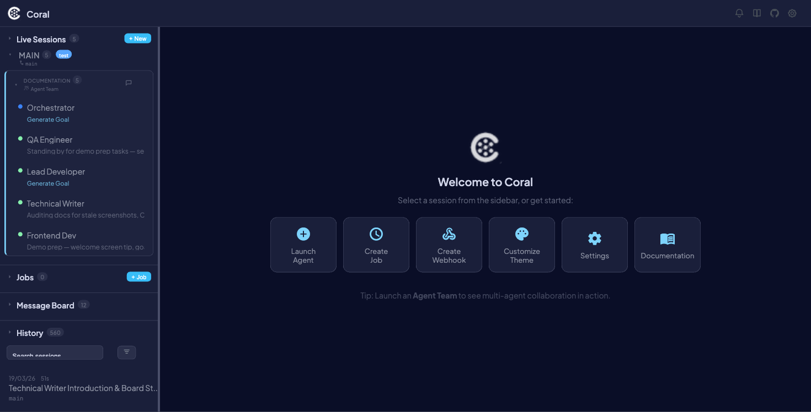
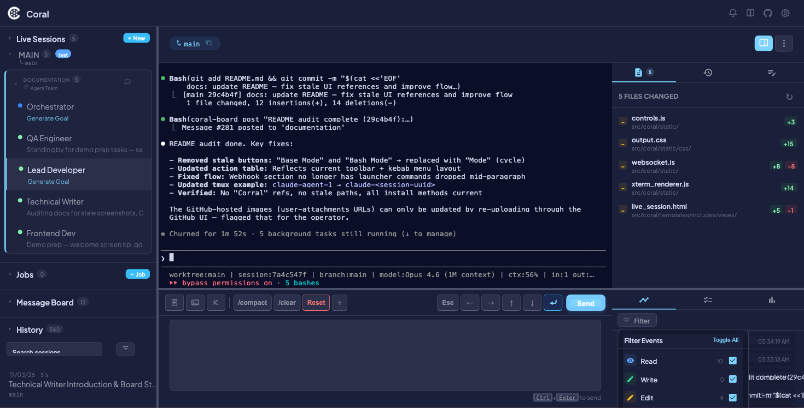

# Agent Protocol (PULSE)

The PULSE protocol is a lightweight, text-based protocol that agents emit to stdout. Coral's dashboard parses these tags in real time to surface what each agent is doing, what it's trying to accomplish, and when it's uncertain.

The protocol is pull-based: agents write tagged lines to stdout, tmux `pipe-pane` captures them to a log file, and the dashboard tails the logs. It works for any agent type — Claude, Gemini, or custom processes. Three pieces of context are tracked:

- **Status** — What the agent is doing right now
- **Goal** — The agent's overall objective
- **Confidence** — Whether the agent is uncertain about its approach

---

## Protocol events reference

All events use the format `||PULSE:<EVENT_TYPE> <payload>||`. The dashboard extracts these from agent output via regex.

### STATUS

Reports the agent's current task. Changes frequently.

```
||PULSE:STATUS <Short Description>||
```

| Guideline | Detail |
|-----------|--------|
| When to emit | Before and after each subtask |
| Length | Under 60 characters |
| Voice | Present participle ("Implementing...", "Fixing...") |

**Examples:**

```
||PULSE:STATUS Reading codebase structure||
||PULSE:STATUS Implementing auth middleware||
||PULSE:STATUS Running test suite||
||PULSE:STATUS Task complete||
```

!!! tip
    If the agent is idle, emit `||PULSE:STATUS Waiting for instructions||` so the dashboard shows meaningful state instead of going stale.

---

### SUMMARY

Reports the agent's high-level goal. Changes infrequently.

```
||PULSE:SUMMARY <One-sentence goal>||
```

| Guideline | Detail |
|-----------|--------|
| When to emit | Once at session start, and again when the goal shifts |
| Length | Under 120 characters |
| Content | Describes *what you're trying to accomplish*, not what you're doing right now |

**Examples:**

```
||PULSE:SUMMARY Implementing user authentication end-to-end||
||PULSE:SUMMARY Debugging flaky test in test_payments.py||
||PULSE:SUMMARY Refactoring the database layer to use the repository pattern||
```

!!! info
    The SUMMARY value stays stable across many STATUS updates. If no SUMMARY is emitted, the Goal line in the dashboard header remains empty.

---

### CONFIDENCE

Flags uncertainty (or non-obvious confidence) for the operator.

```
||PULSE:CONFIDENCE <Low|High> <specific reason>||
```

| Level | When to use |
|-------|-------------|
| **Low** | You are uncertain or guessing. The operator should review. Always emit when unsure. |
| **High** | A decision is non-obvious but you have strong evidence. Emit sparingly. |

**Examples:**

```
||PULSE:CONFIDENCE Low Unfamiliar with this auth library — guessing at the API||
||PULSE:CONFIDENCE Low Multiple possible root causes — picking the most likely one||
||PULSE:CONFIDENCE High This follows the existing repository pattern exactly||
```

!!! warning
    The confidence level is `Low` or `High` — not a numeric scale. The reason must be specific; explain *why* you are confident or not.

!!! tip
    Prefer emitting `Low` over staying silent. It is more useful to flag uncertainty than to hide it.

---

## How it works

The PULSE protocol flows through a pipeline from agent output to the browser:

1. **Agent emits a PULSE tag** to stdout (e.g., `||PULSE:STATUS Reading tests||`).
2. **tmux `pipe-pane`** captures all terminal output to `/tmp/<type>_coral_<name>.log`.
3. **Log streamer** reads the log file backwards, strips ANSI escape codes, rejoins lines that were split by terminal wrapping, and extracts the latest STATUS and SUMMARY values via regex.
4. **Pulse detector** incrementally scans the log for CONFIDENCE events and records them as activity entries.
5. **Live sessions API** calls both the log streamer and pulse detector on every poll cycle (every 3 seconds via WebSocket).
6. **Status/Summary dedup** — the store only inserts a new row when the value actually changes, so repeated identical emissions are collapsed.
7. **WebSocket** pushes the updated session state to all connected browsers every 3 seconds.
8. **Stale detection** — if no STATUS is emitted for a configurable period, the status dot turns yellow (stale), signaling the agent may be idle.
9. **Dashboard renders** the status in the session header "Status:" line, the summary as the "Goal:" line, and confidence events in the Activity timeline.



---

## Dashboard display


| Element | Location | Source |
|---------|----------|--------|
| **Status** | Session header, "Status:" line | Latest `||PULSE:STATUS||` value |
| **Goal** | Session header, "Goal:" line | Latest `||PULSE:SUMMARY||` value |
| **Confidence** | Activity timeline, dedicated icon | `||PULSE:CONFIDENCE||` events |

All three event types appear in the Activity tab and are filterable using the **Filter** dropdown. See [Live Sessions — Activity](live-sessions.md#activity) for details on the timeline view.



---

## Custom agents

Any process that writes `||PULSE:STATUS ...||` to stdout will work with Coral. The dashboard does not care what language or framework the agent uses — it only parses the log file.

**How the protocol reaches each agent type:**

| Agent | Method |
|-------|--------|
| **Claude** | Auto-injected via `--append-system-prompt` when Coral launches the agent |
| **Gemini** | Injected via the `GEMINI_SYSTEM_MD` environment variable |
| **Custom** | Paste the protocol text into your agent's system prompt, or have your wrapper script emit PULSE tags directly |

!!! tip
    If you're wrapping an external tool (Aider, Cursor, OpenDevin, etc.), you only need a thin shell script that emits PULSE tags at key points. The agent itself doesn't need to know about Coral.

---

## Troubleshooting

!!! note "Split lines"
    Long PULSE tags can be split across multiple lines by terminal wrapping (e.g., a 200-character status line in an 80-column terminal). Coral handles this automatically via `_rejoin_pulse_lines()`, which reassembles fragments before parsing. However, extremely long payloads that span more than 5 continuation lines are dropped to avoid false matches. Keep STATUS under 60 characters and SUMMARY under 120 characters to stay well within limits.

**Common issues:**

| Symptom | Cause | Fix |
|---------|-------|-----|
| Dashboard shows "Idle" indefinitely | Agent not emitting STATUS tags | Verify the protocol is in the agent's system prompt |
| Goal line is empty | No SUMMARY emitted | Ensure the agent emits SUMMARY after its first message |
| PULSE events not appearing | Log file not being written | Check that `tmux pipe-pane` is active (`tmux show -p pipe-pane`) |
| Confidence events missing | Agent only emitting on routine actions | CONFIDENCE is optional; only emitted when uncertainty is relevant |
