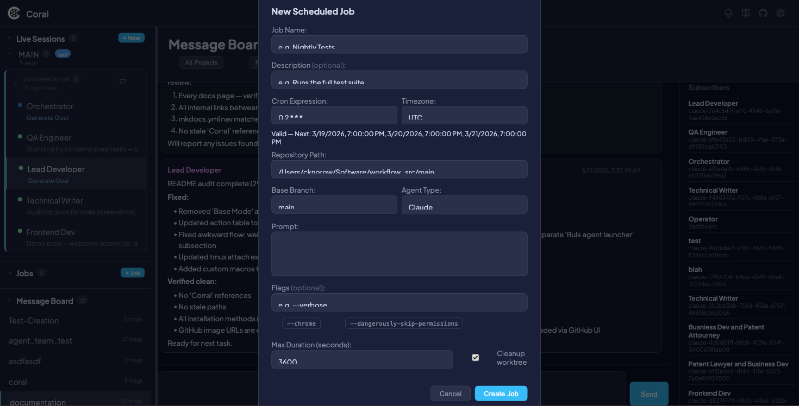

# Scheduled Jobs

Scheduled Jobs let you define recurring agent tasks that run automatically on a cron schedule. Each job specifies a cron expression, timezone, repository path, agent type, and prompt. When the scheduler fires, Coral launches the agent in an isolated git worktree, monitors it with a watchdog, and records the result — no manual intervention required.

Every run is tracked with a status (pending, running, completed, killed, or failed) and linked to a full session for review.

!!! tip
    Looking for one-shot tasks instead of recurring schedules? See the [Jobs API](api/jobs.md) for launching single runs programmatically.

---

## Use cases

- **Nightly test suites** — Run your full test suite every night and review results in the morning.
- **Recurring maintenance** — Schedule dependency updates, lint passes, or formatting fixes on a cadence.
- **Automated code review** — Have an agent review open PRs on a schedule.
- **Branch-isolated execution** — Each run gets its own worktree branched from a base branch, so scheduled work never conflicts with manual development.
- **Hands-off operation** — Define the job once, and Coral handles launching, monitoring, timeout enforcement, and cleanup.

---

## Creating a scheduled job



1. Click the **+ New Job** button in the Scheduled Jobs sidebar header.
2. Fill in the **Create Scheduled Job** modal:

| Field | Required | Default | Description |
|-------|----------|---------|-------------|
| **Job Name** | Yes | — | A short identifier for the job (e.g., "Nightly Tests") |
| **Description** | No | — | Optional longer description of what the job does |
| **Cron Expression** | Yes | `0 2 * * *` | Five-field cron schedule (see [Cron schedule](#cron-schedule) below) |
| **Timezone** | Yes | `UTC` | IANA timezone name (e.g., `America/New_York`, `Europe/London`) |
| **Repo Path** | Yes | Pre-filled | Path to the git repository |
| **Base Branch** | Yes | `main` | Branch to create the worktree from for each run |
| **Agent Type** | Yes | — | Claude or Gemini |
| **Prompt** | Yes | — | The instruction prompt sent to the agent when the job starts |
| **Flags** | No | — | CLI flags for the agent. Use the shortcut buttons for common flags like `--dangerously-skip-permissions` |
| **Max Duration** | Yes | `3600` | Maximum run time in seconds before the watchdog kills the agent (minimum 60) |
| **Cleanup Worktree** | No | Off | When enabled, the worktree is deleted after the run completes |

The modal includes a **live cron preview** that validates your expression in real time and shows the next 3 scheduled fire times.

3. Click **Create** to save the job.

!!! info
    The cron preview updates as you type and flags invalid expressions immediately, so you can verify the schedule before saving.

---

## Cron schedule

Scheduled Jobs use standard five-field cron syntax.

### Format

```
┌───────────── minute (0–59)
│ ┌───────────── hour (0–23)
│ │ ┌───────────── day of month (1–31)
│ │ │ ┌───────────── month (1–12)
│ │ │ │ ┌───────────── day of week (0–6, Sun=0)
│ │ │ │ │
* * * * *
```

### Special characters

| Character | Meaning | Example |
|-----------|---------|---------|
| `*` | Any value | `* * * * *` — every minute |
| `,` | List | `0,30 * * * *` — at minute 0 and 30 |
| `-` | Range | `9-17 * * * *` — hours 9 through 17 |
| `/` | Step | `*/15 * * * *` — every 15 minutes |

!!! info
    When both **day of month** and **day of week** are set to non-wildcard values, the job fires when **either** condition is met (OR logic), not both.

### Common examples

| Expression | Description |
|------------|-------------|
| `0 2 * * *` | Daily at 2:00 AM |
| `*/15 * * * *` | Every 15 minutes |
| `0 9 * * 1-5` | Weekdays at 9:00 AM |
| `0 0 1 * *` | First day of every month at midnight |
| `30 4 * * 0` | Sundays at 4:30 AM |
| `0 */6 * * *` | Every 6 hours |

### Timezone support

All cron expressions are evaluated in the timezone specified on the job. The default is `UTC`. Use any valid [IANA timezone name](https://en.wikipedia.org/wiki/List_of_tz_database_time_zones) — for example, `America/Chicago`, `Asia/Tokyo`, or `Europe/Berlin`.

---

## Managing jobs

### Viewing job details


Click a job in the sidebar to open its detail view. The detail view shows:

- **Info grid** — Job name, description, cron expression, timezone, repo path, base branch, agent type, max duration, and cleanup setting.
- **Prompt** — The full prompt text sent to the agent.
- **Run history** — A table of all past and current runs (see [Run history](#run-history) below).

### Editing a job

Click the **Edit** button to reopen the job modal pre-populated with the current settings. All fields can be modified. Changes take effect on the next scheduled run.

### Pausing and resuming

Toggle a job between active and paused using the **Pause** / **Resume** button.

- A paused job displays a **PAUSED** label in the sidebar and detail view.
- The scheduler skips paused jobs — no runs are created while paused.
- Resuming a job returns it to the normal schedule immediately.

### Deleting a job

Click **Delete** to permanently remove a job.

!!! warning
    Deleting a job **cascades** — all associated run history and session links are permanently removed. This action cannot be undone.

---

## Run history


Each job maintains a run history table with the following columns:

| Column | Description |
|--------|-------------|
| **Scheduled Time** | When the run was scheduled to fire |
| **Status** | Color-coded badge: green for completed, blue for running, red for failed, orange for killed, gray for pending |
| **Duration** | Wall-clock time from start to finish |
| **Exit Reason** | Why the run ended (e.g., "completed", "timeout", "error message") |
| **Session** | Clickable link to the full session view with terminal output, activity, and history |

---

## Sidebar indicators

Scheduled jobs appear in the sidebar with visual indicators for quick scanning:

- **Status dot** — Color reflects the most recent run: green (completed), blue (running), red (failed), white (no runs yet).
- **Job name** — The display name of the job.
- **Paused indicator** — Shown when the job is paused.
- **Cron expression** — The schedule in compact form.

---

## Configuration

### Global settings

| Setting | Method | Default | Description |
|---------|--------|---------|-------------|
| Max concurrent jobs | `CORAL_MAX_CONCURRENT_JOBS` env var | `5` | Maximum number of scheduled jobs that can run simultaneously |
| Scheduler poll interval | — | `30s` | How often the scheduler checks for jobs to fire |
| Watchdog poll interval | — | `30s` | How often the watchdog checks running jobs for timeout |
| Worktree path pattern | — | `{repo}/.coral-jobs/{job_id}/{run_id}` | Where job worktrees are created |

### Per-job settings

| Setting | Default | Description |
|---------|---------|-------------|
| `max_duration_s` | `3600` | Maximum run time in seconds before the watchdog kills the agent |
| `cleanup_worktree` | `false` | Whether to delete the worktree after the run finishes |
| `base_branch` | `main` | Git branch to create the worktree from |
| `flags` | — | Additional CLI flags passed to the agent |

---

## API reference

For full details on request and response formats, see the [Jobs API documentation](api/jobs.md). The scheduled jobs endpoints are:

| Method | Endpoint | Description |
|--------|----------|-------------|
| `GET` | `/api/scheduled/jobs` | List all scheduled jobs |
| `POST` | `/api/scheduled/jobs` | Create a new scheduled job |
| `PUT` | `/api/scheduled/jobs/{id}` | Update an existing job |
| `DELETE` | `/api/scheduled/jobs/{id}` | Delete a job and all its run history |
| `POST` | `/api/scheduled/jobs/{id}/toggle` | Pause or resume a job |
| `GET` | `/api/scheduled/jobs/{id}/runs` | Get run history for a specific job |
| `GET` | `/api/scheduled/runs/recent` | Get recent runs across all jobs |
| `POST` | `/api/scheduled/validate-cron` | Validate a cron expression and return next fire times |
