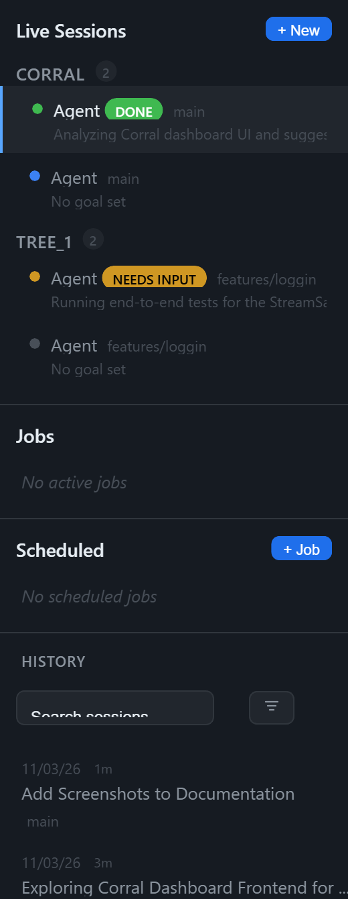
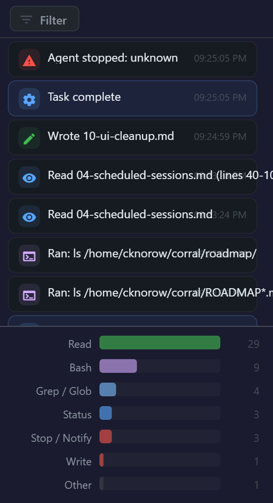
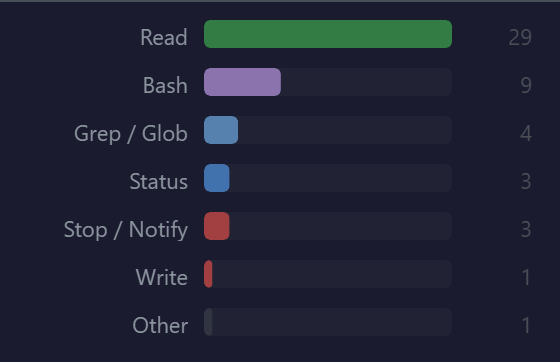

# Metrics & Observability

Corral provides built-in observability for your AI coding agents without requiring any external monitoring tools. From a single browser tab, you can track real-time agent state, review activity timelines, inspect session history metrics, and monitor git state — all updated automatically.

The focus is on **activity observability**: what agents are doing, how long they've been doing it, and what they've produced. Cost and token tracking are not currently included.

---

## What Corral tracks

Corral continuously monitors four categories of information for every agent:

- **Real-time agent state** — Active, Working, Waiting, or Idle, derived from staleness and event type
- **Activity event timeline** — Tool uses, status changes, confidence signals, and stop/notify events
- **Session history metrics** — Duration, message counts, tool use breakdowns, and auto-generated summaries
- **Git state** — Current branch, latest commit, and remote URL, polled every 2 minutes

---

## Real-time monitoring

### Sidebar status dots

Every live session in the sidebar has a color-coded status dot that updates automatically:

| Color | State | Meaning |
|-------|-------|---------|
| **Green** | Active | Agent produced output within the last 60 seconds |
| **Blue** | Working | Agent is actively using a tool (`tool_use` event detected) |
| **Amber** | Waiting | Agent has stopped or sent a notification and needs input |
| **Grey** | Idle / Stale | No recent output — agent may have finished or stalled |

### Hover tooltips

Hover over any session in the sidebar to see a tooltip with key details:

- **State** — Current status dot state (Active, Working, Waiting, Idle)
- **Last Action** — Most recent tool or event type
- **Goal** — High-level objective from `||PULSE:SUMMARY||`
- **Status** — Current task from `||PULSE:STATUS||`
- **Branch** — Git branch the agent is working on
- **Agent** — Agent type (Claude or Gemini)

### Staleness display

The sidebar shows how recently each agent was active using human-readable timestamps: "Just now", "30s ago", "2m ago", and so on. This makes it easy to spot agents that may need attention without opening each session.

---

## Activity panel

The Activity tab in the [side panel](live-sessions.md#side-panel) provides a detailed, real-time view of agent behavior.

### Event timeline

Every tool use and protocol event appears in a scrollable timeline with an icon, description, and timestamp. Event types include:

| Icon category | Events |
|---------------|--------|
| File operations | Read, Write, Edit |
| Shell | Bash |
| Search | Grep, Glob |
| Network | Web (fetches) |
| Orchestration | Tasks, Subagents |
| Protocol | Status, Goal, Confidence |
| Control | Stop, Notify |

### Filter dropdown

The filter dropdown at the top of the Activity tab lets you toggle event categories on and off. Each category shows a count of how many events of that type have occurred in the current session, making it easy to see at a glance what the agent has been doing most.

### Activity bar chart

Below the timeline, a horizontal bar chart shows tool use counts sorted by frequency. This gives you an immediate sense of the agent's work pattern — whether it's been mostly reading files, running shell commands, editing code, or something else.

---

## Real-time metrics

These metrics are available for every live session and update continuously:

| Metric | Source | Where it appears |
|--------|--------|------------------|
| Agent state | `staleness_seconds` + `latest_event_type` | Sidebar status dot |
| Current status | `PULSE:STATUS` protocol event | Session header + hover tooltip |
| Current goal | `PULSE:SUMMARY` protocol event | Session header + hover tooltip |
| Tool use counts | `agent_events` grouped by `tool_name` | Activity bar chart |
| Git branch / commit | `git_snapshots` table | Sidebar + Info modal |
| Task progress | `agent_tasks` table | Tasks tab badge |

!!! tip
    For details on how agents report status and goals, see the [Agent Protocol](protocol.md) documentation.

---

## Historical metrics

After a session ends, Corral preserves a rich set of metrics in the [session history](session-history-search.md):

| Metric | Source | Where it appears |
|--------|--------|------------------|
| Session duration | `last_timestamp - first_timestamp` | History sidebar + search filter |
| Tool use breakdown | `agent_events` table | History Activity tab |
| Git commits | `git_snapshots` with time-range overlap | Commits tab |
| Auto-summary | `BatchSummarizer` via Claude CLI | History sidebar + Notes tab |
| Tags | `session_tags` table | History sidebar + filter |

!!! info
    Auto-summaries are generated asynchronously after sessions end. They appear in the history sidebar and the Notes tab once processing completes.

---

## Background services

Corral runs several background services to collect and process observability data:

| Service | Interval | Purpose |
|---------|----------|---------|
| **Session Indexer** | 120s | Scans JSONL history files, indexes sessions, and builds FTS search index |
| **Batch Summarizer** | Continuous | Generates auto-summaries for queued sessions via Claude CLI |
| **Git Poller** | 120s | Polls branch, commit, and remote URL per live agent |
| **Idle Detector** | 60s | Fires [webhooks](webhooks.md) when agents wait longer than 5 minutes |

These services run automatically when the Corral web server starts. No configuration is required.

---

## Searching and filtering

Corral includes full-text search powered by SQLite FTS5 with porter stemming. You can search across all historical sessions by keyword, and results are ranked by relevance.

### Advanced filters

Beyond text search, the history view supports filtering by:

- **Date range** — Find sessions from a specific time period
- **Duration range** — Filter by how long sessions lasted (e.g., only sessions longer than 30 minutes)
- **Source type** — Filter by agent type (Claude, Gemini)
- **Tags** — Filter by session tags with AND/OR logic for combining multiple tags

!!! tip
    Combine full-text search with filters to quickly locate specific sessions. For example, search for "auth refactor" filtered to the last week and sessions longer than 10 minutes. See [Session History & Search](session-history-search.md) for the full search guide.

---

## Key UI elements

A quick reference for the observability-related UI components you'll encounter:

| Element | Location | Purpose |
|---------|----------|---------|
| **Status dot** | Sidebar, session header | Color-coded agent state indicator |
| **Activity bar chart** | Activity tab (bottom) | Tool use frequency distribution |
| **Event timeline** | Activity tab | Scrollable log of all agent events |
| **Filter dropdown** | Activity tab (top) | Toggle event categories with counts |
| **Session tooltip** | Sidebar (hover) | Quick view of agent state, goal, status, branch |
| **Duration badge** | History sidebar | How long a completed session lasted |
| **Staleness display** | Sidebar | Time since last agent output |
| **Commits list** | Commits tab | Git commits made during the session |

---

## Related pages

- [Live Sessions](live-sessions.md) — Real-time monitoring and control interface
- [Session History & Search](session-history-search.md) — Browsing and searching completed sessions
- [Agent Protocol](protocol.md) — How agents report status, goals, and confidence
- [Webhooks](webhooks.md) — Notifications for idle agents and other events
