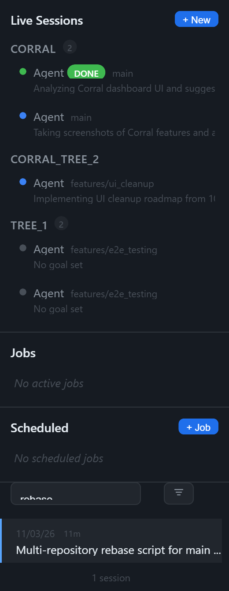
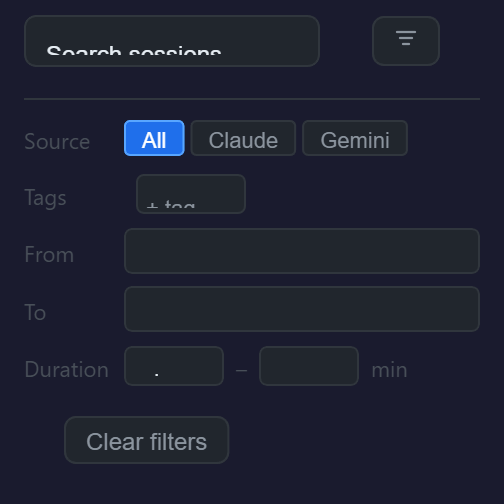
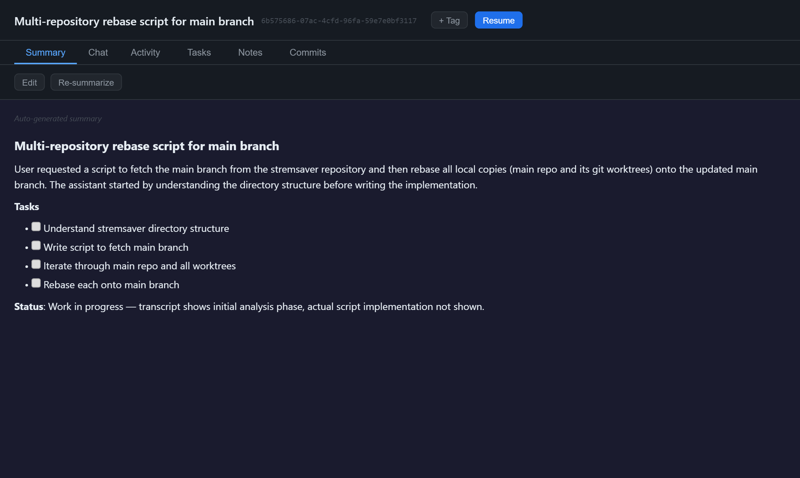

# Session History & Search

Corral automatically indexes every Claude and Gemini coding session into a searchable database. Whether you ran a quick one-off prompt or a multi-hour refactoring marathon, every session is preserved and searchable from the dashboard.

Sessions are discovered from Claude history files (`~/.claude/projects/*/*.jsonl`) and Gemini session files, then indexed into SQLite with FTS5 full-text search. A background `SessionIndexer` scans for new or updated session files every 120 seconds, so recent sessions appear without any manual action. Each newly discovered session is also enqueued for AI-powered summarization — `BatchSummarizer` generates a markdown summary using `claude --print --model haiku`, giving you a readable overview of what happened in each session.

The result is a browsable, searchable archive of every coding conversation across all your projects and agents.

---

## Why it's useful

- **Find past work fast** — Full-text search across every message in every session. Search for a function name, error message, or topic and jump straight to the relevant session.
- **Track what agents did** — See the full transcript, activity timeline, commits, and tasks for any historical session, even weeks later.
- **Organize with tags** — Tag sessions by feature, project, or priority and use tags as filters for quick retrieval.
- **Pick up where you left off** — Resume any Claude session on a live agent with full conversation context restored.
- **AI-generated summaries** — Every session gets an auto-generated markdown summary so you can skim history without re-reading entire transcripts.

---

## Browsing history

The **History** section of the sidebar lists all indexed sessions, sorted by most recent activity. Each sidebar entry shows:

- Timestamp and duration
- Agent type badge (Claude or Gemini)
- Git branch name
- Tags (as colored pills)
- Summary title (first heading from the AI-generated summary)

Click any session to open it in the main panel. The list paginates at 50 sessions per page — use the pagination controls at the bottom of the sidebar to navigate older sessions.



---

## Searching sessions

Type in the search box at the top of the History sidebar to search across all indexed sessions. Results are ranked by FTS5 relevance when a search query is active, rather than by recency.

The search indexes the **full body of all messages** — both your prompts and the agent's responses. This means you can search for specific code snippets, error messages, file paths, or any text that appeared in a conversation.


!!! tip
    FTS5 uses Porter stemming by default, so searching for "testing" also matches "test", "tests", and "tested".

---

## Using advanced filters

Click the **funnel icon** next to the search box to open the advanced filter panel. When filters are active, a badge on the funnel icon shows the number of active filters.

### Available filters

| Filter | Options | Description |
|--------|---------|-------------|
| **FTS Mode** | Phrase / All words / Any word | Controls how search terms are combined (see [Search syntax](#search-syntax-and-tips)) |
| **Source** | All / Claude / Gemini | Filter by agent type |
| **Tags** | Select one or more tags, with AND/OR logic | Show only sessions with specific tags |
| **Date Range** | From / To date pickers | Limit results to a time window |
| **Duration** | Min / Max duration | Filter by session length |

Use the **Clear filters** button to reset all filters at once. Filter state is encoded in the URL, so you can bookmark or share a filtered view.



---

## Viewing a session

When you open a historical session, the main panel shows a header with session metadata and six content tabs.

### Session header

The header displays the session timestamp, duration, agent type badge, branch, and summary title. Action buttons include:

| Button | Description |
|--------|-------------|
| **Resume** | Resume this session on a live agent (Claude only) |
| **+ Tag** | Add a tag to this session |

### Content tabs

#### Summary

The Summary tab shows the AI-generated markdown summary of the session. This is produced automatically by the `BatchSummarizer` and provides a readable overview of the session's goals, actions, and outcomes.

Two buttons appear at the top of the tab:

- **Edit** — Open a markdown editor to write or revise the summary
- **Re-summarize** — Re-run the AI summarizer to generate a fresh summary



#### Chat

The Chat tab shows the full conversation transcript between you and the agent. User messages, assistant responses, and tool-use cards (Bash commands, file edits, reads, etc.) are all displayed in order.

#### Activity

The Activity tab shows an event timeline and bar chart of agent actions during the session. Events include file reads, writes, edits, bash commands, searches, and PULSE protocol events. Use the filter controls to toggle specific event types on or off.

#### Tasks

The Tasks tab displays the task checklist associated with the session. Tasks are read-only in historical sessions but show their completion state with checkboxes.

#### Notes

The Notes tab shows any agent-written notes from the session. These are the notes the agent recorded while working, separate from the user-editable summary.

#### Commits

The Commits tab lists all git commits that occurred during the session's time range. Each commit shows its hash, message, author, and timestamp.


---

## Tagging sessions

Tags help you organize sessions by project, feature, status, or any other category.

### Adding a tag

1. Click the **+ Tag** button in the session header.
2. Select an existing tag from the dropdown, or create a new one by entering a name and picking a color.
3. The tag appears as a colored pill on the session entry in the sidebar and in the session header.

### Using tags as filters

Tags are available as a filter in the [advanced filter panel](#using-advanced-filters). You can select multiple tags and choose whether to match sessions with **all** selected tags (AND) or **any** of them (OR).


---

## Writing and editing notes

### Editing the summary

Click the **Edit** button on the Summary tab to open a markdown editor. Write or revise the summary content and save. Once you manually edit a summary, the auto-summarizer will not overwrite your changes — user edits are always preserved.

### Re-summarizing

Click the **Re-summarize** button to discard the current auto-generated summary and queue the session for a fresh AI summary. This is useful if the original summary was generated before the session was complete, or if you want to regenerate it after clearing a manual edit.

!!! info
    The Re-summarize button only regenerates the AI summary. If you have manually edited the summary, your edits take priority and the auto-summary is stored separately. Clear your manual edits first if you want the re-generated summary to be displayed.

---

## Resuming a session

You can continue any historical Claude session on a live agent:

1. Open the session in the history view.
2. Click the **Resume** button in the session header.
3. In the Resume modal, select which currently live agent should continue the session.
4. Corral restarts the selected agent with `--resume`, loading the full conversation context from the previous session.

The resumed session picks up with full context, so the agent remembers everything from the original conversation.

!!! warning
    Resume is supported for **Claude agents only**. Gemini does not support session resume.

For more on live session management, see [Live Sessions](live-sessions.md).

---

## Search syntax and tips

### FTS modes

| Mode | Behavior | Example query | Matches |
|------|----------|---------------|---------|
| **All words** (default) | All terms must appear (AND) | `auth middleware` | Sessions containing both "auth" and "middleware" |
| **Phrase** | Exact phrase match | `auth middleware` | Sessions containing the exact phrase "auth middleware" |
| **Any word** | Any term can appear (OR) | `auth middleware` | Sessions containing "auth" or "middleware" or both |

### Porter stemming

FTS5 uses Porter stemming, which means search terms are reduced to their root form:

| You search for | Also matches |
|----------------|-------------|
| `testing` | test, tests, tested |
| `configured` | configure, configures, configuration |
| `running` | run, runs, ran |

### What is indexed

The search index contains the **full text of all messages** in each session — both user prompts and agent responses, including tool inputs and outputs. This means you can search for:

- Code snippets and function names
- Error messages and stack traces
- File paths
- Natural language descriptions of tasks

### Quoted sub-phrases

You can include quoted sub-phrases within an All words or Any word query. For example, in All words mode, `"error handling" refactor` matches sessions containing both the exact phrase "error handling" and the word "refactor".

### Safety

FTS5 operator tokens (`AND`, `OR`, `NOT`) entered as bare words in the search box are stripped automatically to prevent query injection. This means you can safely search for the word "not" without it being interpreted as a boolean operator.

---

## How indexing works

The indexing pipeline runs automatically in the background as part of the Corral web server.

1. **SessionIndexer** scans all agent history file paths every 120 seconds. It tracks each file's `file_mtime` and skips files that have not changed since the last scan.
2. New or updated sessions are upserted into the `session_index` table, and their full message text is inserted into the `session_fts` FTS5 virtual table.
3. Each newly indexed session is enqueued in the `summarizer_queue` table.
4. **BatchSummarizer** polls the queue and processes up to 5 pending sessions at a time, generating markdown summaries via `claude --print --model haiku`.

### Triggering a manual re-index

If you need sessions to appear immediately without waiting for the next 120-second cycle, send a POST request:

```bash
curl -X POST http://localhost:8420/api/indexer/refresh
```

### Database location

All session data is stored in `~/.corral/sessions.db` (SQLite, WAL mode). The database includes the session index, FTS5 search index, tags, notes, summaries, and the summarizer queue.
