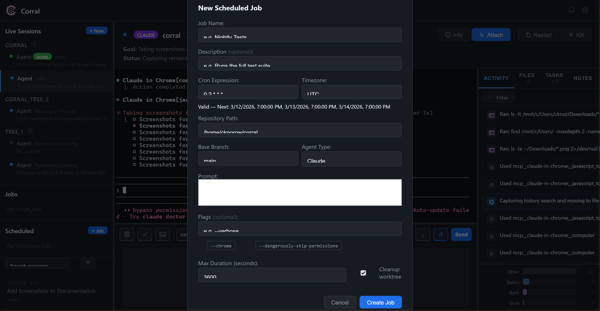
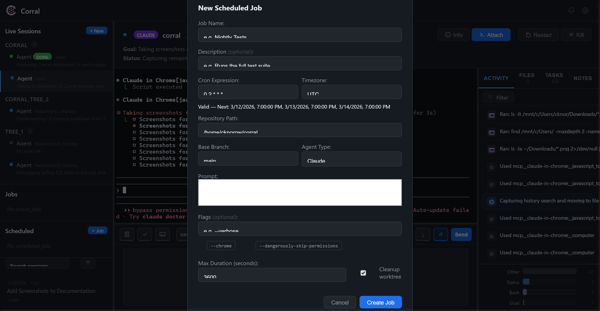

# Webhook Notifications

Webhook Notifications let you receive HTTP POST alerts when an agent needs attention. Instead of watching the dashboard, you can route notifications to Slack, Discord, or any HTTP endpoint — so you know the moment an agent is stuck waiting for input.

Corral supports three platforms out of the box: **Slack**, **Discord**, and **Generic HTTP POST**. Webhooks are configured entirely through the dashboard UI, with built-in retry logic and a circuit breaker to keep things reliable without overwhelming a failing endpoint.



---

## How it works

Corral monitors every live agent session. When an agent has been waiting for input for **5 or more minutes**, a `needs_input` event fires and is dispatched to all matching webhooks. The notification fires **once per waiting period** — it will not repeat until the agent becomes active again and then re-enters a waiting state.

Each delivery attempt follows this reliability model:

- **Retry schedule** — Up to 3 attempts with exponential backoff: 30 seconds, 2 minutes, 10 minutes.
- **Circuit breaker** — After 10 consecutive delivery failures, the webhook is automatically disabled to prevent noise.
- **Timeout** — Each HTTP attempt times out after 10 seconds.

---

## Setting up webhooks

### Creating a webhook

1. Click the **Webhooks** button in the toolbar.
2. Click **+ Add Webhook**.
3. Fill in the form:

| Field | Description |
|-------|-------------|
| **Name** | A display label (e.g., "Slack #dev-agents") |
| **Platform** | Slack, Discord, or Generic |
| **URL** | The webhook endpoint URL |
| **Agent Filter** | Optional — limit notifications to specific agents |
| **Enabled** | Toggle the webhook on or off |

4. Click **Save**.



### Slack

1. Go to [api.slack.com](https://api.slack.com) and create a new Slack app (or use an existing one).
2. Under **Incoming Webhooks**, toggle the feature on.
3. Click **Add New Webhook to Workspace** and select the channel you want notifications in.
4. Copy the webhook URL — it looks like `https://hooks.slack.com/services/...`.
5. In Corral, create a new webhook with **Platform** set to **Slack** and paste the URL.
6. Click **Test** to verify the connection.

!!! tip
    Each Slack webhook URL is tied to a specific channel. Create multiple Corral webhooks if you want to notify different channels.

### Discord

1. Open the Discord channel you want to receive notifications in.
2. Go to **Channel Settings > Integrations > Webhooks**.
3. Click **New Webhook**, give it a name, and click **Copy Webhook URL** — it looks like `https://discord.com/api/webhooks/...`.
4. In Corral, create a new webhook with **Platform** set to **Discord** and paste the URL.
5. Click **Test** to verify the connection.

### Generic HTTP POST

Any HTTP endpoint that accepts a JSON POST body and returns a `2xx` status code to acknowledge receipt. Use this for custom integrations, monitoring systems, or internal tooling.

Set **Platform** to **Generic** and provide your endpoint URL.

---

## Testing webhooks

Click the **Test** button next to any webhook in the list. This sends a test `needs_input` event immediately — it bypasses the normal dispatch queue so you get instant feedback.

A toast notification shows the result: success or failure with the HTTP status code. The test delivery also appears in the webhook's **History** view.

!!! info
    The test event uses synthetic data, so you can verify formatting and connectivity without waiting for a real agent to go idle.

---

## Viewing delivery history

Click **History** on any webhook to see up to 50 recent deliveries. Each entry shows:

| Column | Description |
|--------|-------------|
| **Status** | `delivered`, `failed`, or `pending` |
| **Agent** | Which agent triggered the event |
| **Event Type** | The event that fired (e.g., `needs_input`) |
| **Summary** | Human-readable description of the event |
| **Timestamp** | When the delivery was attempted |

Failed deliveries show the HTTP status code and error message for debugging.


---

## Managing webhooks

### Editing

Click a webhook in the list to open it for editing. Change any field and click **Save**.

### Disabling

Toggle the **Enabled** switch off to pause a webhook without deleting it. Deliveries stop immediately and queued retries are skipped.

### Deleting

Click **Delete** to permanently remove a webhook and its delivery history.

### Auto-disable on repeated failures

If a webhook accumulates **10 consecutive delivery failures**, Corral automatically disables it and shows an **Auto-Disabled** badge. This prevents a broken endpoint from consuming retry resources indefinitely.

To recover, fix the underlying issue (expired URL, server down, etc.), then manually re-enable the webhook and click **Test** to confirm.

!!! warning
    Auto-disabled webhooks will not fire again until you explicitly re-enable them. Check the webhook list periodically if you rely on notifications.

---

## Events

Corral currently supports one webhook event type:

| Event | Trigger | Behavior |
|-------|---------|----------|
| `needs_input` | Agent has been idle for 5+ minutes while waiting for input | Fires once per waiting period. Clears when the agent becomes active again. |

Each event carries this schema:

| Field | Description |
|-------|-------------|
| `agent_name` | Name of the agent session |
| `session_id` | UUID of the session |
| `event_type` | The event type string (e.g., `needs_input`) |
| `event_summary` | Human-readable description |

---

## Payload formats

Each platform receives a differently formatted payload optimized for its rendering engine.

### Slack

```json
{
  "blocks": [
    {
      "type": "section",
      "text": {
        "type": "mrkdwn",
        "text": ":raising_hand: *Corral — NEEDS_INPUT*\n*Agent:* `agent-name`\n*Message:* Agent needs input — waiting for 12 minutes"
      }
    }
  ]
}
```

### Discord

```json
{
  "embeds": [
    {
      "title": "Corral — NEEDS_INPUT",
      "description": "Agent needs input — waiting for 12 minutes",
      "color": 13801762,
      "fields": [
        {
          "name": "Agent",
          "value": "`agent-name`",
          "inline": true
        }
      ],
      "footer": {
        "text": "Corral"
      }
    }
  ]
}
```

### Generic

```json
{
  "agent_name": "agent-name",
  "session_id": "uuid",
  "event_type": "needs_input",
  "summary": "Agent needs input — waiting for 12 minutes",
  "timestamp": "2025-03-11T10:05:00+00:00",
  "source": "corral"
}
```

---

## Reliability details

| Parameter | Value |
|-----------|-------|
| Retry attempts | 3 |
| Backoff schedule | 30 seconds, 2 minutes, 10 minutes |
| Circuit breaker threshold | 10 consecutive failures |
| Delivery history retention | Latest 200 per webhook |
| Idle detector polling interval | 60 seconds |
| Dispatcher polling interval | 15 seconds |
| Idle threshold | 5 minutes |
| Notification behavior | One-shot per waiting period |
| URL validation | HTTPS required (except `localhost`) |
| Request timeout | 10 seconds per attempt |

---

## UI reference

| Element | Description |
|---------|-------------|
| Webhook modal | Main overlay opened via the **Webhooks** toolbar button |
| List view | Shows all configured webhooks with name, platform, and status |
| Status dot | Green (enabled), gray (disabled) |
| Auto-Disabled badge | Red badge indicating circuit breaker tripped |
| Platform label | `SLACK`, `DISCORD`, or `GENERIC` next to each webhook |
| Agent filter | Shows which agents the webhook applies to, or "All" |
| Form | Add/edit form with name, platform, URL, agent filter, and enabled toggle |
| History view | Per-webhook delivery log with status, agent, event, summary, and timestamp |
| Test button | Sends a synthetic event immediately to verify connectivity |

---

## See also

- [Live Sessions](live-sessions.md) — Real-time agent monitoring and control
- [One-Time Jobs](one-time-jobs.md) — Jobs API, including the `webhook_url` parameter for per-job notifications
- [Scheduled Jobs](scheduled-jobs.md) — Recurring job scheduling
